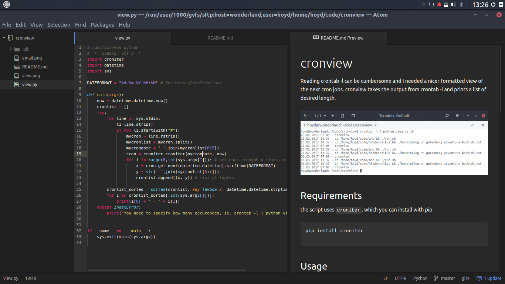
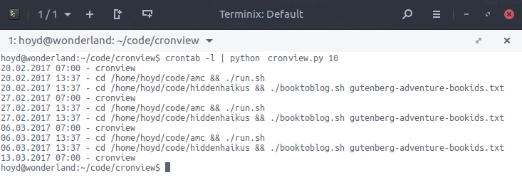
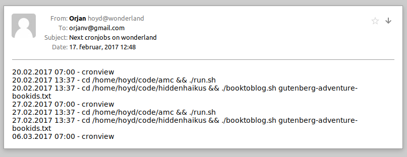

# cronview
Reading crontab -l can be cumbersome and I needed a nicer formatted view of the next cron jobs. cronview takes the output from crontab -l and prints a list of desired length.  



## Requirements

the script uses `croniter`, which you can install with pip

```bash
pip install croniter
```

## Usage
### Print the four next cron jobs
In linux, crontab -l prints the cron jobs for your user. Simply pipe the content from crontab -l into the script and specify how many occurences, ie.

```bash
crontab -l | python cronview.py 4
```



### Print the three next cron job for a specific user
You can also show the cron agenda for a different user like this:

```bash
crontab -u username -l | python cronview.py 100
```

### Print the 100 next cron jobs for a specific cron file
You can also show the cron agenda for a different cron file like this:

```bash
cat /etc/cron.d/yourcrontab | python cronview.py 100
```

### Get cron job agenda delivered to your inbox regularly
You can also setup a cron job to automatically send you an email regularly with a list of the upcoming cron jobs. Require mailutils to be installed.

Write a bashscript such as

```bash
#!/bin/sh
crontab -l | python /path/to/cronview/cronview.py 10 | mailx -s "Next cronjobs on wonderland" emailaddress
```
Then, add it to PATH by for example making a symbolic link to it

```bash
sudo ln -s /usr/local/bin/crontab2email /path/to/bashscript.sh
```
Now, add a cron job using `crontab -e` for example like this
```bash
0 7 * * 1 crontab2email
```
to send yourself an email every monday at 07:00



## Suggestions?
Suggestions, use the issue tracker or improve the script yourself. I'm happy for push requests.
